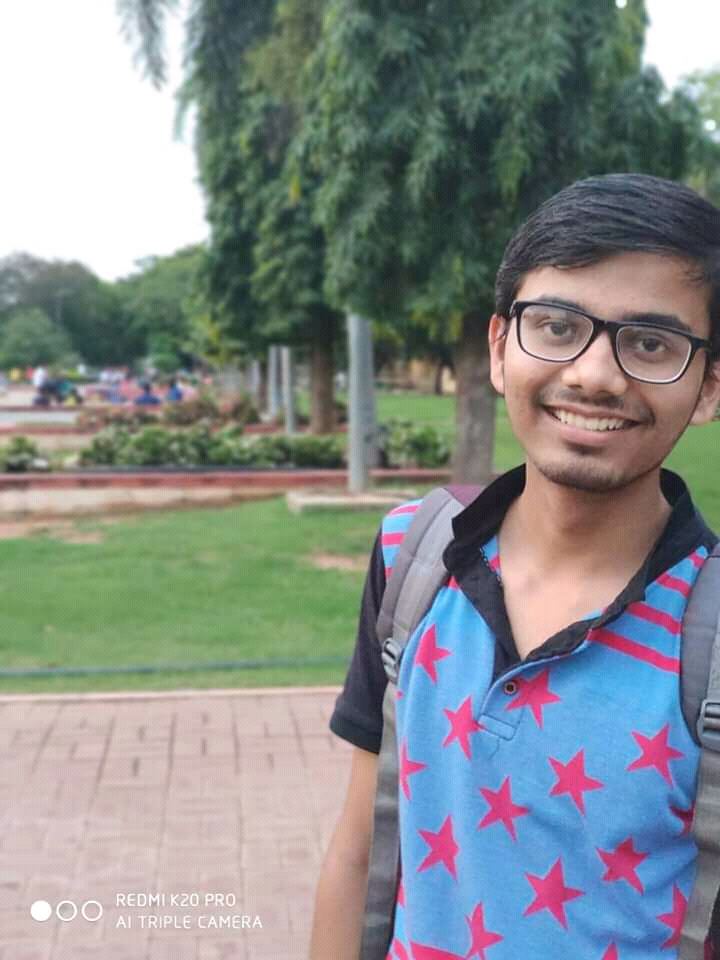

<h1>
 Anshuman Mishra 
</h1>
  <h3>
First Year Undergrad @ National Institute of Technology Warangal 
</h3>
  <h4>
Electronics & Communication Engineering
</h4>

  

##### [My Resume](https://docs.google.com/document/d/1z9zfWX0TodUE_q0lCsrmCh7_hTsn4ZfMpQItLoD8J2w/edit)

### Projects

1. **[Handsigns](https://shivanshuman021.github.io/HandSigns/)**:
   - **Technology** - Deep Learning (Computer Vision)
   - **Framework** - Tensorflow 2.1 , Keras
   - **Deployment & Operation** - Command Line based
   - **Programming Language** - Python
  
2. **[Objecto](https://shivanshuman021.github.io/Objecto/)**:   
   - **Technology** - Deep Learning (Computer Vision)
   - **Framework** - PyTorch 2.1
   - **Deployment & Operation** - Android 
   - **Programming Language** - Python , Java , XML
 
3. **[NAiV](https://github.com/shivanshuman021/Technocrats-NAiV)**:
   - **Project type** - Team (Smart India Hackathon 2020)
   - **Technology** - Robotics , Deep Learning 
   - **Frameworks** - Django
   - **Deployment & Operation** - Android , WebApp 
   - **Programming Language** - Python , Java , XML
   
4. **[Object-Tracker](https://shivanshuman021.github.io/Object-Tracker/)**
   - **Technology** - Deep Learning
   - **Deployment & Operation** - Command Line based 
   **Programming Language** - Python
   
5. **[Image Style Transfer](https://shivanshuman021.github.io/Image-Style-Transfer/)**:
   - **Technology** - Deep Learning (Computer Vision) 
   - **Frameworks** - Tensorflow , Keras , PyTorch
   - **Deployment & Operation** - Jupyter Notebook , Command Line based
   - **Programming Language** - Python
   
6. **[TaskManager](https://shivanshuman021.github.io/TaskManager/)**:
   - **Technology** - Desktop App
   - **Framework** - XOJO
   - **Deployment & Operation** - Windows / Linux / MacOS
   
7. **[FRTurtle](https://github.com/shivanshuman021/FRTurtle)**:
    _Face Recognition System with turtle console for output Under Developement in collaboration with [Sufiyan Ansari](https://github.com/suffisme)_
    
8. **[Image Denoising with AutoEncoders]**:
   - **Technology** - Deep Learning (Computer Vision)
   - **Framework** - Keras
   - **Programming Language** - Python

9. **[Tic-Tac-Toe Android](https://github.com/shivanshuman021/Tic-Tac-Toe-Android)**:
   - Android App for Tic-Tac-Toe game
    

### Support or Contact

[LinkedIn](https://www.linkedin.com/in/anshuman-mishra-89b014195)

**Email**:
   - mishra_941920@student.nitw.ac.in
   - shivanshuman021@gmail.com
   - shivanshuman021@outlook.com
